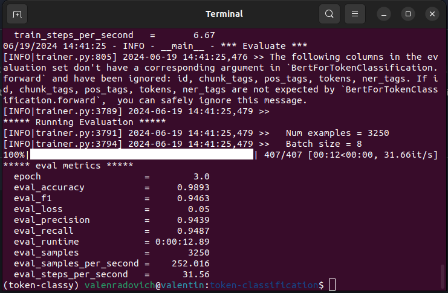

# named entity recognition: fine-tuning BERT

i'm providing a simple example of how to fine-tune a BERT model for named entity recognition (NER) using pytorch and transformers. 

you'll find the code in the .ipynb format, which you can run in google colab or jupyter notebook and the .py format (found the example on hugging face transformer documentation), which you can run in your local machine or VM.

the notebook is just easier to run and understand (in colab is ready-to-go), but the .py file is suitable to use as script. 
both are very organized and can be reproduced with any dataset just following the instructions in the code.

[CONLL 2003 dataset](https://aclanthology.org/W03-0419.pdf) is used in this example.

## results

the model was trained for 3 epochs and achieved the following results in colab:
```json
{'eval_loss': 0.06109246239066124,
 'eval_precision': 0.9292045202747617,
 'eval_recall': 0.9382481261886118,
 'eval_f1': 0.933704425271361,
 'eval_accuracy': 0.9837958917819754,
 'eval_runtime': 5.937,
 'eval_samples_per_second': 547.411,
 'eval_steps_per_second': 34.361,
 'epoch': 3.0}
```

same with the script:



## how to run
the notebook is ready to run in google colab, just open it and run all cells.

the script can be run in your local machine or VM, just run the following command in the terminal to train the model in the same dataset as i did:
```bash
run.sh
```

## requirements

```bash
pip install -r requirements.txt
``` 

